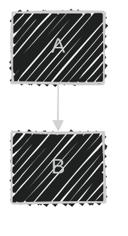

<p align="center">
  
</p>

<h1 align="center">Mermaid Live Editor</h1>

<p align="center">
  A browser-based live editor for <a href="https://mermaid.js.org/">Mermaid.js</a> diagrams.<br/>
  Write Mermaid syntax on the left, see the rendered diagram instantly on the right.
</p>

<p align="center">Made by <a href="https://github.com/Parithosh-Varma">Parithosh Varma</a></p>

## Features

- **Live Preview** — Diagrams render in real-time as you type
- **Monaco Editor** — Full-featured code editor with Mermaid syntax highlighting, minimap, and adjustable font size
- **Multiple Diagrams** — Work on multiple diagrams in tabs, each saved independently
- **Pan & Zoom** — Drag to pan, scroll to zoom, fit-to-screen, and zoom controls
- **Themes & Styles** — 11 built-in themes, 3 visual looks (classic, hand-drawn, neo), and multiple layout engines
- **Export** — Download as SVG, PNG (2x), or PNG (4x) with configurable background color and transparency
- **Share** — Generate a shareable URL with QR code, or copy Markdown/Image embed snippets
- **Dark Mode** — Toggle between light and dark UI
- **Presentation Mode** — Fullscreen diagram view (Ctrl+Shift+P)
- **Import** — Open `.mmd`, `.md`, or `.txt` files via file picker or drag-and-drop
- **Frontmatter Config** — Override theme, look, and layout per diagram using YAML frontmatter
- **Keyboard Shortcuts** — Ctrl+S to save, Ctrl+K for shortcuts, Ctrl+Shift+P for presentation
- **LocalStorage Persistence** — Diagrams and settings persist across sessions
- **Single-File Build** — Builds to a single self-contained HTML file via `vite-plugin-singlefile`

## Supported Diagram Types

Flowchart, Sequence, Class, State, ER, Gantt, Pie, Git Graph, Mindmap, User Journey, Timeline, Quadrant, Requirement, Sankey, and C4 diagrams.

## Getting Started

```bash
npm install
npm run dev
```

Open [http://localhost:5173](http://localhost:5173) in your browser.

## Build

```bash
npm run build
```

Outputs a single `dist/index.html` file that can be opened directly in any browser.

## Frontmatter Configuration

Override global settings per diagram by adding YAML frontmatter at the top of your code:



## Keyboard Shortcuts

| Action | Shortcut |
|---|---|
| Save diagram | `Ctrl+S` |
| Presentation mode | `Ctrl+Shift+P` |
| Show shortcuts | `Ctrl+K` |
| Exit presentation | `Esc` |

## Tech Stack

- React 19 + TypeScript
- Vite 7
- Tailwind CSS 4
- Monaco Editor
- Mermaid.js 11
- Panzoom
- QRCode.js

## License

MIT
